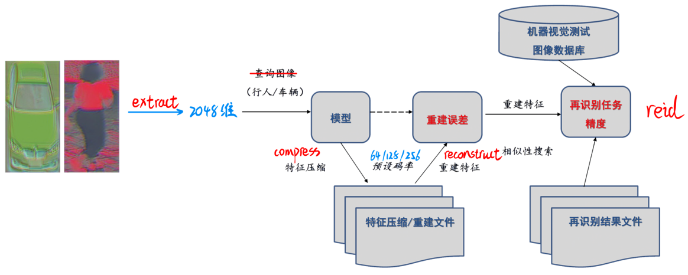

# NAIC2021 reid
[NAIC2021 reid](https://naic.pcl.ac.cn/contest/10/35/38) 复赛阶段代码（特征提取、压缩重建、重识别）



```
./
├─extract.py	            
├─compress.py            	
├─reconstruct.py			
├─reid.py
├─reid_fastreid.py		
├─train_resnet.py			# resnet训练（以后再补）
├─train_update.py			# autoencoder训练
└─project
   ├─fastreid				# 京东fastreid
   ├─AutoEncoder.py
   ├─.yml
   └─.pth
```

相关文件下载：

- [数据集、预训练模型](https://pan.baidu.com/s/15ifSH08xKoFfHUE7eDHeqw) 提取码：3721

扩充数据集图片来源：

- [京东fastreid完整代码](https://github.com/JDAI-CV/fast-reid)   [论文](https://arxiv.org/abs/2006.02631)
- [初赛重识别代码](https://gitee.com/xiaoyumike/fast-reid-naic2021-demo) 可用于训练
